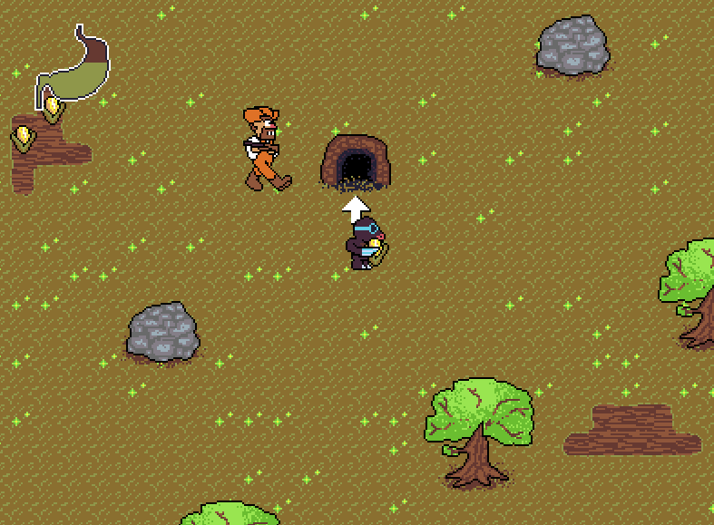
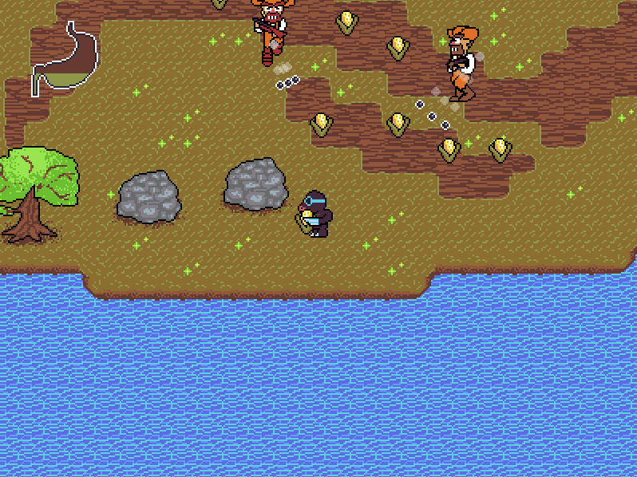

# KROT

KROT is an arcade game about a mole that steals corn from farmers.
The objective is to bring the corn to the mole's hideout while dodging the farmers' bullets and eating to avoid starvation. The mole has the ability
to burrow underground in order to avoid hazards and stay undetected, but this
prevents the mole from carrying the corn.

The game was made using Godot 3.5. It was supposed to be my entry to Ludum Dare 52, where the theme was "harvest," but I got carried away. Among the addons used is Vinicius Gerevini's Aseprite Wizard, which allowed me to streamline the export of sprites from my Aseprite project files. The music was made using Sunvox.

The game code and other files are licensed under GPL3. 

Play it on [itch.io](https://x54321.itch.io/krot) or [my website](https://tophatdemon.com/en/games/krot).

 
